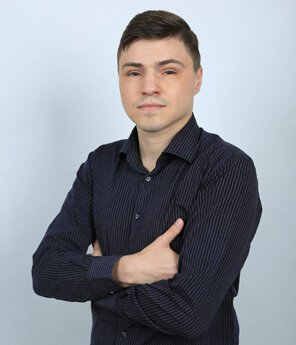

#   Curriculum vitae of Rolling scopes student
### Main information

- **Name**: Oleg Trenkenshu
- **Date of birth**: 01.08.1985
- **Email**: trenkenshu@gmail.com
- **Discord**: trenkenshu #5166
- **Phone**: +375 (29) 87 88 506
- **City of residence**: Minsk
### Education
- **1992-2002** Secondary education in the Gymnasium of the highest category of Nizhniy Tagil
- **2002-2005** Unfinished higher education in the specialty "Computer engineering and automated systems software" in at the UPI, Ekaterinburg
- **2007-2008** Unfinished higher education in the specialty "Banking business" at the MIMR, Moskow
### Work
- **2010-2015** Self employment in Web design, layout design
- **2015-2022** Director and owner of ["Krendel" interior design studio](https://k-design.by)
### Skills
- Middle **HTML/CSS3**
- Middle *jQuery*
- Pre-junior **JS**
- Pre-junior **NodeJS**
- Pre-junior **Git**
- English at A2+
### Code example
This function takes an array with arbitrary data  and returns array with positive numbers sorted out of the initial array (excluding nested arrays).
```
function sortOut(ar) {
  if (ar.constructor.name == 'Array') {
    var ind = 0;
    var indAnswer = 0;
    var answer = [];
    while (ind < ar.length) {
      if (typeof ar[ind] == 'number' && ar[ind] > 0) {
        answer[indAnswer] = ar[ind];
        indAnswer++;
      }
      ind++;
    }
    return answer;
  } else {
    console.log('the data is not an array');
    return false;
  }
}
```
### A few words about myself
Hi! My name is Oleg. I've already got experience in Web development for 5 years. I've worked as a designer and layout designer on different projects based on *Joomla* and *Wordpress* starting with simple landings and ending with one of the first online grocery stores of Ekaterinburg with integration with 1S software. Now I am looking to get better at frontend and backend JS, get deep understanding of development processes to become a pro developer and be a valueble part of one the best software development companies of post-soviet area which EPAM is at the moment. So here I am :)